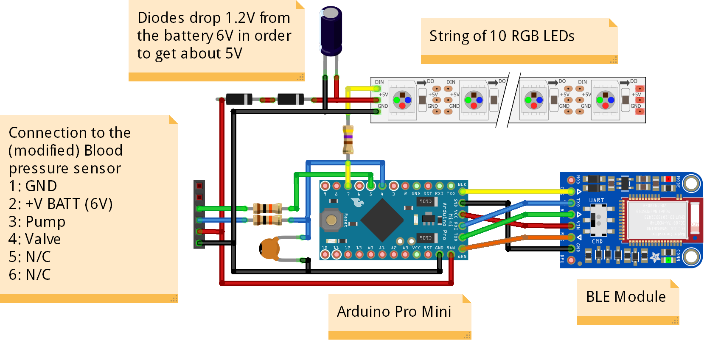

# Building the Blood Pressure Notifier

The blood pressure sensor used for this prototype a typical comercially available sensor. The sensor is can take blood pressure measurements and transmit those measurements over Bluetooth. Typical users can install and app on their mobile phones in order to store the measurements and analyse the evolution of their blood pressure over time. However, such a sensor (i) is not directly usable with elderly users or patient who do not easily use a smartphone and (ii) is not usable to automatically collect and store data remotely. For that a BLE gateway is required to collect the measurements and the device itself is enhanced by a nofification ring which allows interacting with the user in order to:

* To remind the user to take blood pressure measurements
* To confirm that measurements have been transmitted and received by the server
 

The schematic bellow shows the wiring of the electronics of the notification ring:

The main components are and Arduino Pro Mini which includes an AVR ATMega328p microcontroller programmed in ThingML, and RGB LED Strip which fits aroung the notifation ring and a BLE module used to comunicate with the gateway. 

The notification ring is intefaced with the blood pressure sensor in order to detect when measurments are taken. In the case of this prototype the signals from the pump and valve are connected to the microcontroler. In practice, with other sensor, different signals could be used as long as the notification ring can detect that the blood pressure sensor is being used.